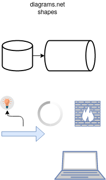
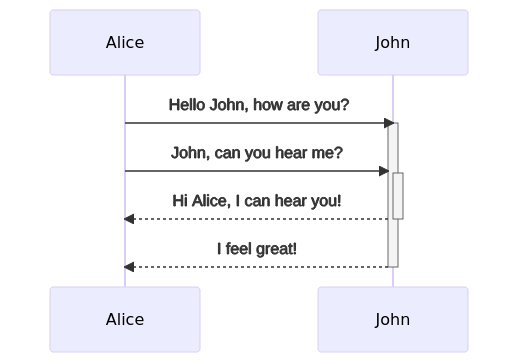

## Communicating Software Architecture with Open Source Tools
<br><br>
Kevin Howell

Principal Software Engineer, Red Hat

---

## Agenda

- Who am I?
- Why you should use diagrams
- What diagrams provide
- What tools exist
- How to start using diagrams

---

## About Me

tech lead for console.redhat.com subscriptions functions

Working with OpenShift (Kubernetes), Java, OpenAPI, Kafka.

---

Also, I am a dog person

<div class="r-stretch">


</div>
---

## Why you should use diagrams

---

Communication is Difficult

---

Software is Complex

<p class="fragment">
   &nbsp; - 27 packages, 23,179 files
</p>
<p class="fragment">
   Linux - over ~1,935 modules, 76,929 files
</p>

note:
* without even getting into how many golang modules are present in k8s
* modules shipped w/ Fedora, files from fresh github clone

---

<p>How do you introduce someone to your codebase/project/infrastructure?</p>

<div class="r-stretch">
  
</div>
<p>
  <small>
    Cliffs of Moher - Clare, Ireland<br>
    by Giuseppe Milo<br>
    CC-BY 2.0<br>
    https://flic.kr/p/W6ZKDs
  </small>
</p>

note:
* Do you throw them off the (metaphorical) cliff and hope they land in the water? (I hope not).

---

# Why Diagrams

---

Diagrams visually convey information

<div class="r-stretch">
  
  </div>
<p>
  <small>
    xkcd - 2251 - Alignment Chart Alignment Chart<br>
    by Randall Munroe<br>
    CC-BY-NC 2.5<br>
    https://xkcd.com/2251/
  </small>
</p>

note:
* all disciplines use diagrams/charts/etc. to help organize and convey information
* TODO: fix image alignment

---

# General Purpose Tools

---

First, let's talk about the most popular diagramming tool you probably already have installed...

note:
* don't throw shade at me for this next slide...

---

Whiteboards & markers (or paper & pen/pencil)

<div class="r-stretch">
  
</div>

note:
* TODO insert image of a whiteboard
* free form
* this plus a smartphone
* analogy extends to notebooks, drawing tablets, etc.
* not good for remote collaboration

---

diagrams.net (formerly draw.io)

<div class="r-stretch">
  
</div>

note:
* free form
* webapp
* lots of shapes built-in - UI elements, network icons, etc.
* reminds me of inkscape, but with lots of built in shapes
* privacy-focused desktop app

---

diagrams.net (formerly draw.io)

<div class="r-stretch">
  
</div>

---

Excalidraw

<div class="r-stretch">
  
</div>

---

These are great, but they're open-ended...

<div class="r-stretch">
  
</div>

<p class="fragment">
  Instead, create diagrams in a more constrained way

  note:
  * I'm going to recommend that you generate diagrams, but the constraints/conventions that apply there can be useful when IRL diagramming too
</p>

---

Graphviz

```
# example.dot
digraph {
  "so graph" -> "much wow"
}
```

```shell
dot -Tsvg example.dot -o example.dot.svg
```
<div class="r-stretch">
  
</div>

Try http://viz-js.com or https://sketchviz.com for interactive editing.

note:
* at its core generates graph layouts using various algorithms

---

PlantUML

* UML sequence diagrams
* C4 Diagrams
* YAML
* JSON

note:
* does much more than UML

---

## PlantUML sequence diagram

console.redhat.com turnpike API gateway mTLS auth flow

<div class="r-stretch">
  
</div>

note:
* I'm not a fan of UML aside from sequence diagrams, too complex.

---

C4

* context (systems)
* container (apps & data)
* component (app components)
* code (classes, modules, etc.)

---

C4: Context Diagram
<div class="r-stretch">

</div>
note:
* for the most part, just boxes
* actors and systems

---

C4: Container Diagram

<div class="r-stretch">

</div>

note:
* deployable artifacts, databases

---

C4: Component Diagram

<div class="r-stretch">

</div>

Source: C4-PlantUML samples

note:
* this is a sample from

---

C4: Code Diagram

Don't do this unless you really have to.

Let your IDE do this.

---

Aside: PlantUML yaml visualization

```yaml
apiVersion: apps/v1
kind: Deployment
metadata:
  name: nginx-deployment
  labels:
    app: nginx
spec:
  replicas: 3
  selector:
    matchLabels:
      app: nginx
  template:
    metadata:
      labels:
        app: nginx
    spec:
      containers:
      - name: nginx
        image: nginx:1.14.2
        ports:
        - containerPort: 80
```

<div class="r-stretch">
  
</div>

---

Shape libraries

* plantuml-stdlib
  * aws
  * kubernetes
* png files
* svg files

---

Mermaid

As of mid-February Github-Flavored-Markdown renders mermaid diagrams.

---

Mermaid: flow chart

```
graph TD
    A[Christmas] -->|Get money| B(Go shopping)
    B --> C{Let me think}
    C -->|One| D[Laptop]
    C -->|Two| E[iPhone]
    C -->|Three| F[fa:fa-car Car]
```
<div class="r-stretch">

</div>

---

Mermaid: sequence diagram

```
sequenceDiagram
    Alice->>+John: Hello John, how are you?
    Alice->>+John: John, can you hear me?
    John-->>-Alice: Hi Alice, I can hear you!
    John-->>-Alice: I feel great!
```

<div class="r-stretch">

</div>

---

Mermaid: state diagram

```
stateDiagram-v2
    [*] --> Still
    Still --> [*]
    Still --> Moving
    Moving --> Still
    Moving --> Crash
    Crash --> [*]
```

<div class="r-stretch">

</div>

---

## Considerations

* your team/organization
* ecosystem
* existing integrations (GitLab + kroki.io, GitHub + mermaid)
* Keep it with the code (less doc-rot)

note:
* maybe you already have a tool of choice, if you don't this is a great opportunity to implement one
* ecosystem - e.g. k8s recommending mermaid now
* doc-rot: think `sed s/MariaDB/Postgres/` or `git grep postgres`
---

# Takeaways

Communication is hard and software is complex; diagrams help.

IRL diagramming is a great tool, but risks doc-rot.

Keep your diagrams with your code.

---

# Resources

Software Architecture for Developers - Simon Brown

https://excalidraw.com

https://diagrams.net

https://plantuml.com

https://c4model.com

https://kroki.io

---

# Feedback

Thank you and stay cool!

<div class="r-stretch">
  
</div>

<p>
kevin@kahowell.net<br>
Twitter: @kevin_a_howell<br>
GitHub: kahowell
</p>
